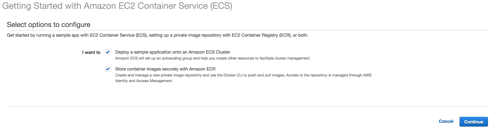
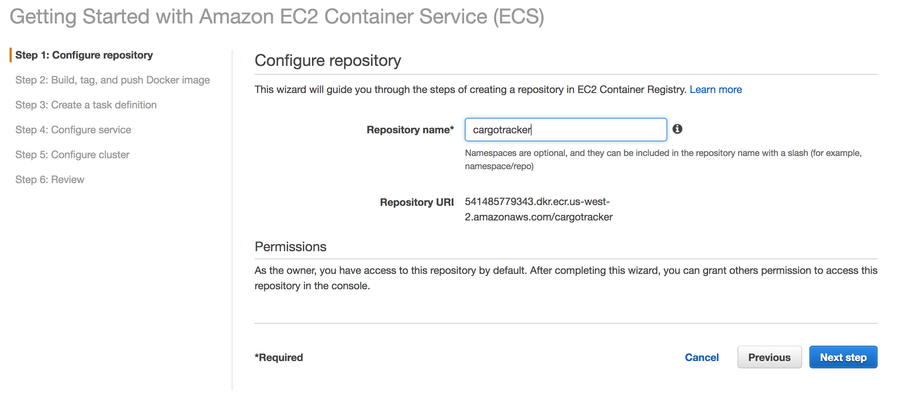
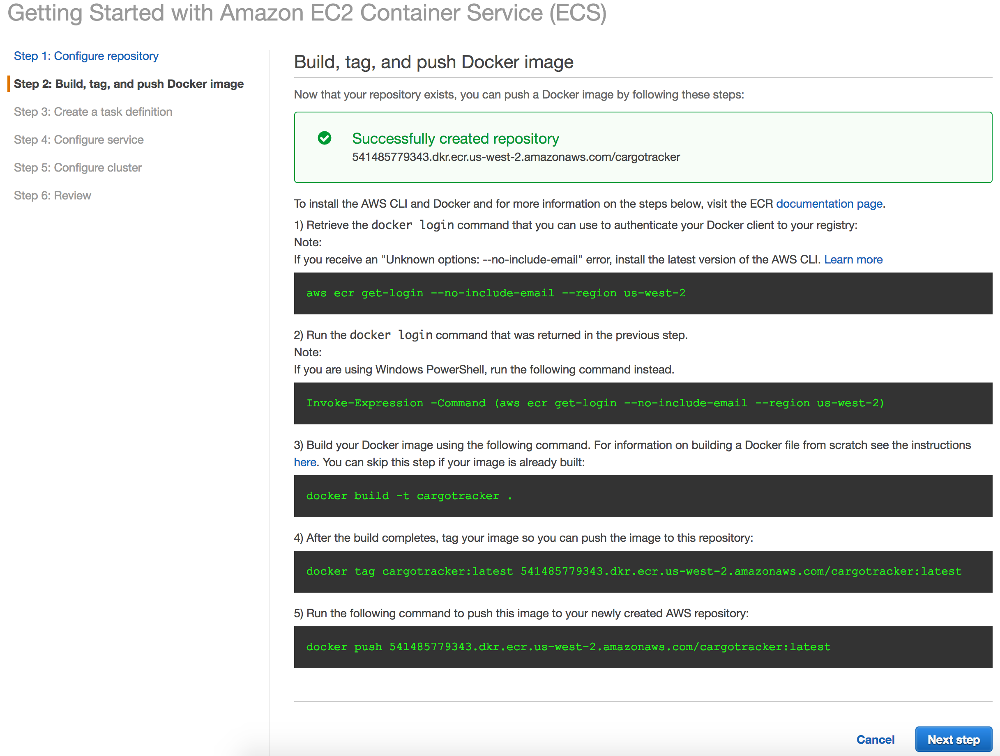
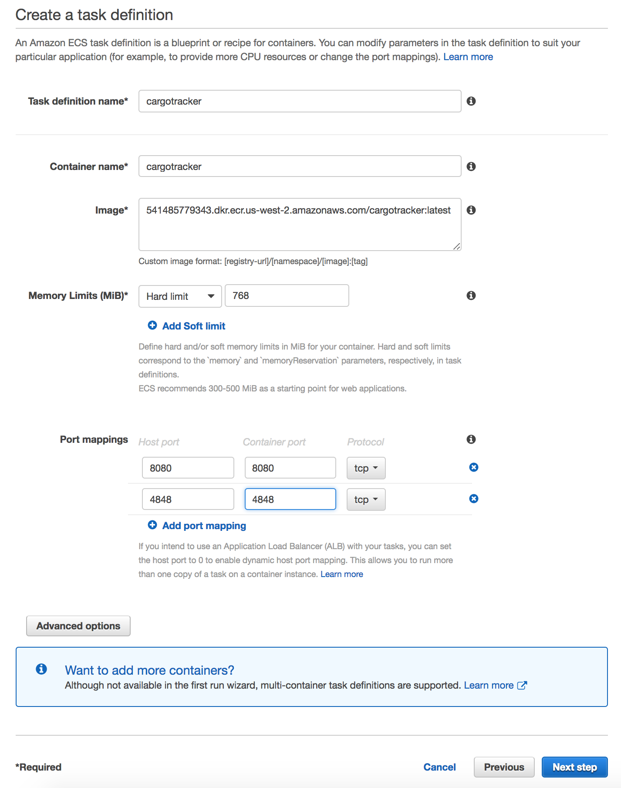
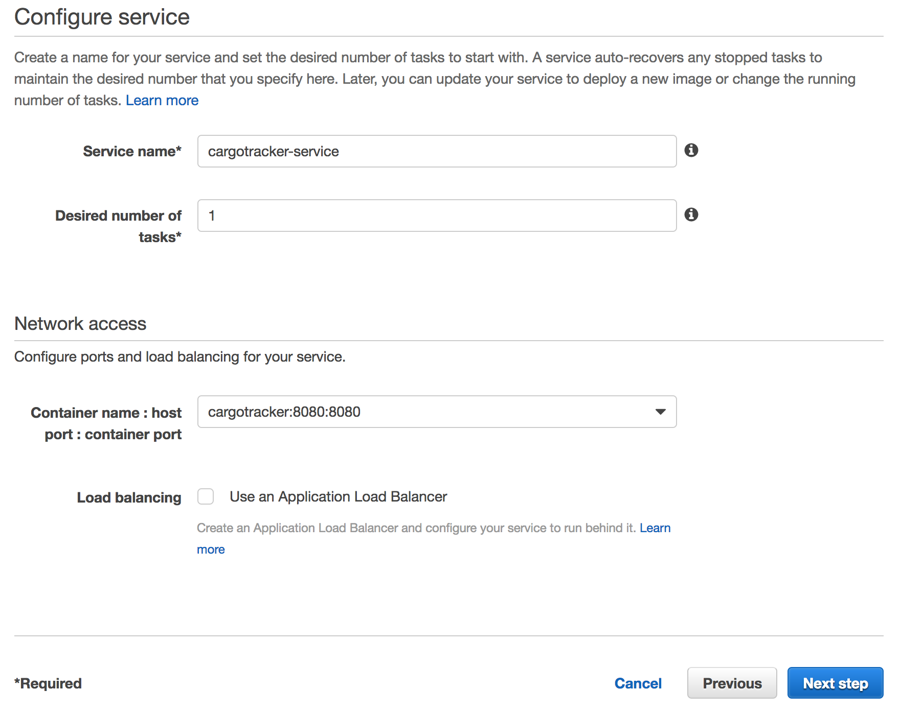
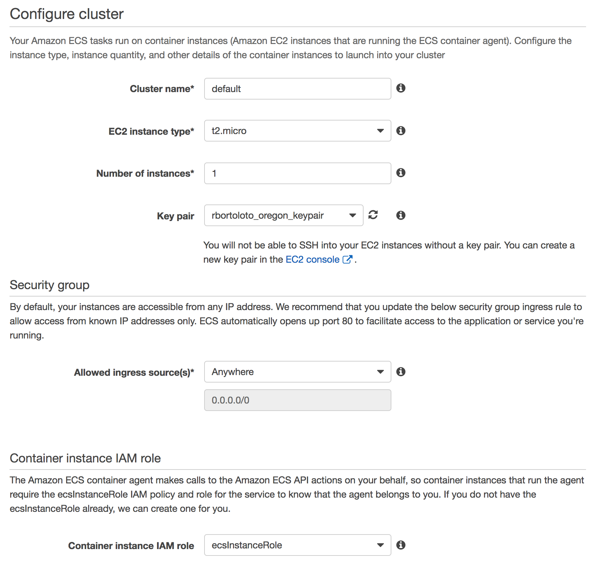
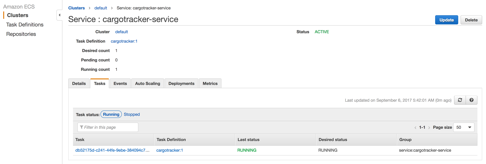

# Running Java EE in a Docker container on EC2 Container Service (ECS)

Stack:

* [EC2](http://docs.aws.amazon.com/AWSEC2/latest/UserGuide/concepts.html)
* [ECR](http://docs.aws.amazon.com/AmazonECR/latest/userguide/what-is-ecr.html)
* [ECS](http://docs.aws.amazon.com/AmazonECS/latest/developerguide/Welcome.html)
  * [Clusters](http://docs.aws.amazon.com/AmazonECS/latest/developerguide/ECS_clusters.html)
  * [Services](http://docs.aws.amazon.com/AmazonECS/latest/developerguide/ecs_services.html)
  * [Tasks](http://docs.aws.amazon.com/AmazonECS/latest/developerguide/scheduling_tasks.html)
  * [Task Definitions](http://docs.aws.amazon.com/AmazonECS/latest/developerguide/task_definitions.html)
* Cargo Tracker with [Payara](https://www.payara.fish/) Server Docker container
  * [Dockerfile](https://raw.githubusercontent.com/rstrazza/cargotracker/master/src/docker/Dockerfile)
  * [Docker image](https://hub.docker.com/r/rstrazza/cargotracker-payara-server/)

## Provisioning AWS infrastructure

* Open the Amazon ECS console [first run wizard](https://console.aws.amazon.com/ecs/home#/firstRun):



### Docker Registry

This demo will use AWS ECR for ease to use and simple integration with AWS ECS. Private docker registries are also support, check the References section for more information.

* Configure the repository:



* One the repository is created, ECR will provide the steps on how to login to the docker registry, tag and push an image. Follow the steps.



* Sample [Dockerfile](https://raw.githubusercontent.com/rstrazza/cargotracker/master/src/docker/Dockerfile) content:

```shell
FROM payara/server-full

COPY cargo-tracker.war /opt/payara41/glassfish/domains/domain1/autodeploy

CMD $PAYARA_PATH/bin/asadmin start-domain --verbose
```

* Example pushing the docker image:

```shell
docker push 541485779343.dkr.ecr.us-west-2.amazonaws.com/cargotracker:latest
The push refers to a repository [541485779343.dkr.ecr.us-west-2.amazonaws.com/cargotracker]
a97cb8747e53: Pushed
391ac9396adc: Pushed
cc5861fb798c: Pushed
fa9fb17dcb0f: Pushed
c42bce907016: Pushed
3b80ea7ca789: Pushed
c98badc633ac: Pushed
3985bc20a806: Pushed
9640ba08218e: Pushed
3d2c411334a9: Pushed
bd9db2a15c4a: Pushed
a07cd0e5de92: Pushed
cecc20f349f8: Pushed
c9e908787496: Pushed
c7ff02c44ca2: Pushed
555f98a2316c: Pushed
b0220a5743fa: Pushed
995042ba10ad: Pushed
fe40be59465f: Pushed
cf4ecb492384: Pushed
latest: digest: sha256:13ab8a42bf6ad7b21976c2652b56a00d93c5da8715de8c96126352339a841c2a size: 4515
```

* Create a Task Definition or in another words, the instructions on how the Docker container should run:



* Configure the Service:



* Configure the ECS Cluster:



* Click on **Review & launch**, validate the setup and proceed by clicking on **Launch instance & run service**.



At the end of the setup, the following AWS resources will be provisioned:
* ECS Cluster
* Task Definition
* ECS Instances
* ECS Service
* CloudFormation
* Internet Gateway
* VPC
* Route table
* 2 Subnets
* Public routing
* Security Group
* Auto Scaling Group
* Launch Configuration

## References

* [Creating an ECR Repository](http://docs.aws.amazon.com/AmazonECR/latest/userguide/repository-create.html)
* [ECS Private Registry Authentication](http://docs.aws.amazon.com/AmazonECS/latest/developerguide/private-auth.html)
* [Getting Started with Amazon ECS ](http://docs.aws.amazon.com/AmazonECS/latest/developerguide/ECS_GetStarted.html)
* [Amazon ECS Container Instances](http://docs.aws.amazon.com/AmazonECS/latest/developerguide/ECS_instances.html)
* [ECS Task Definitions](http://docs.aws.amazon.com/AmazonECS/latest/developerguide/task_definitions.html)
