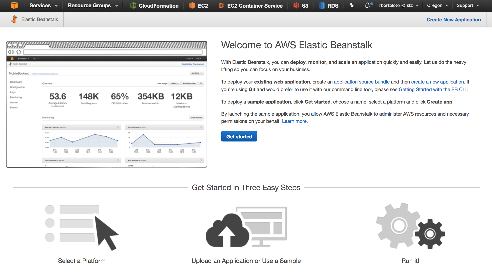
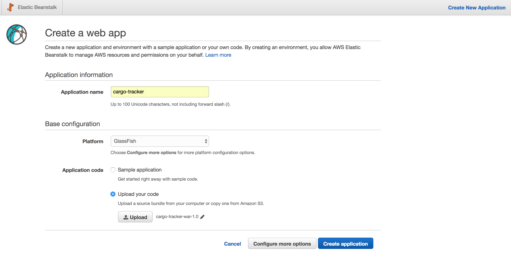
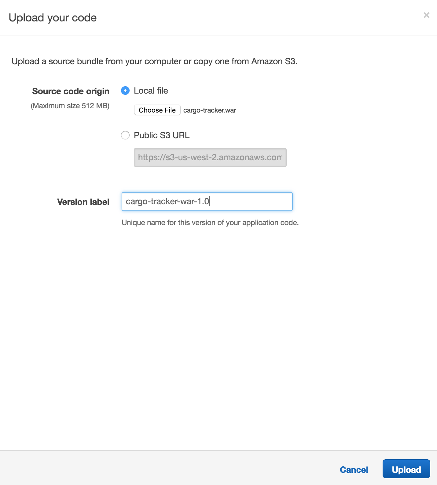
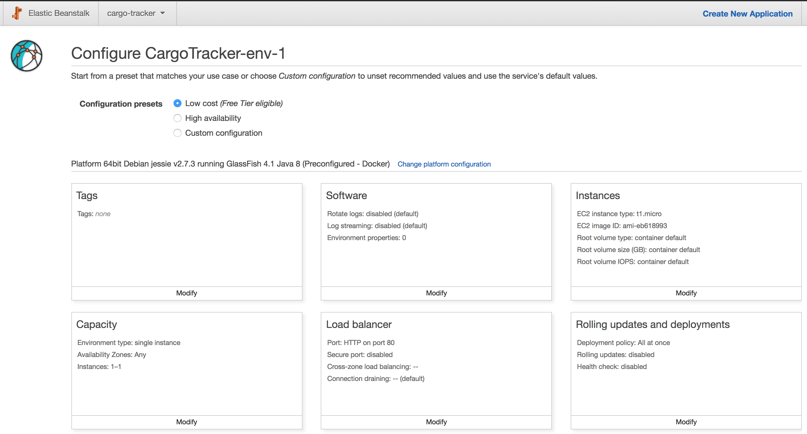
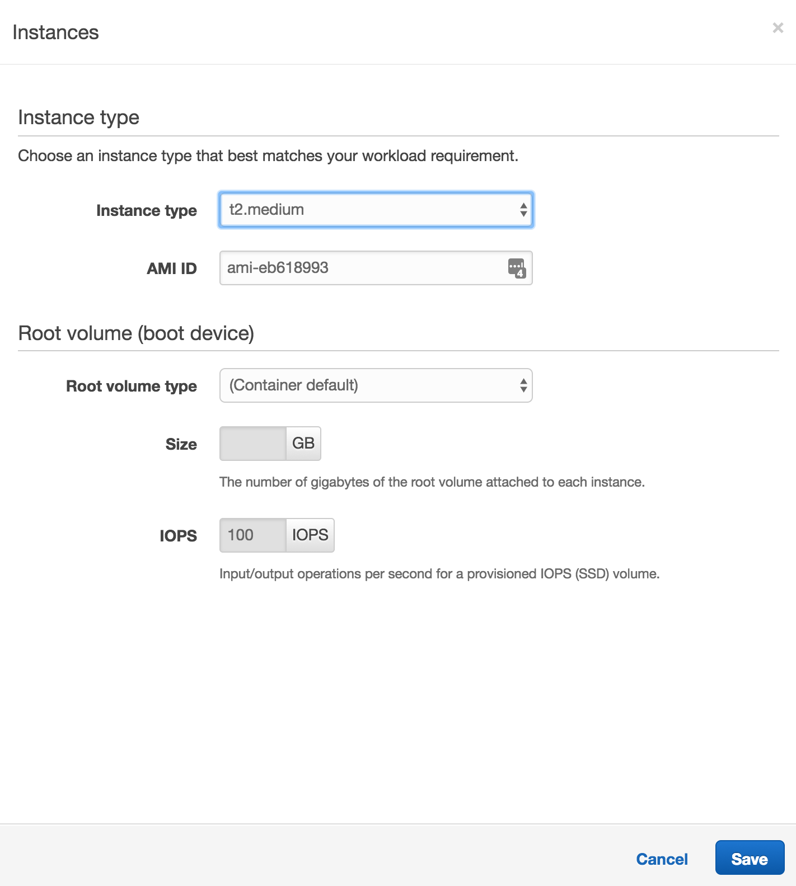
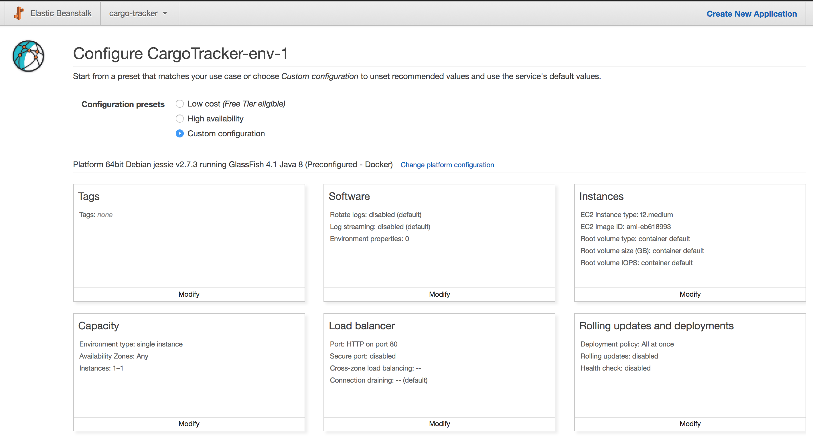
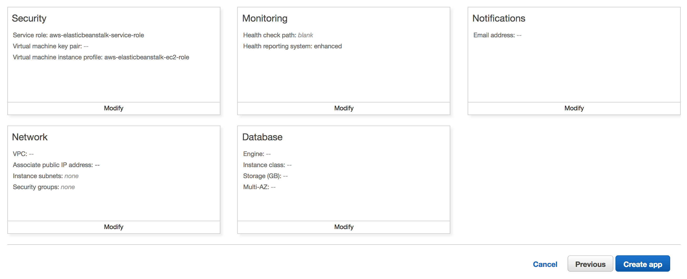
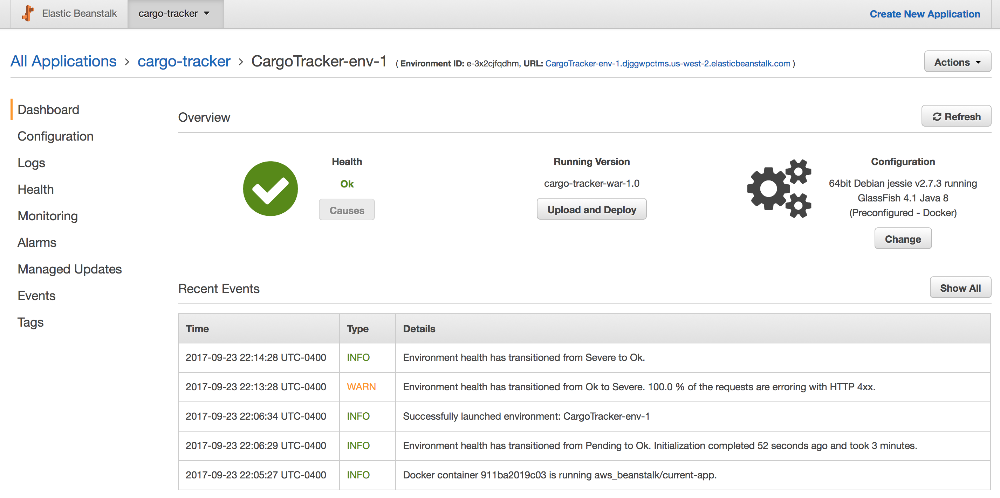

# Running Java EE on Elastic Beanstalk

[AWS Elastic Beanstalk](https://docs.aws.amazon.com/elasticbeanstalk/latest/dg/Welcome.html) aims at taking control of the underlying infrastructure necessary to run applications, offering to handle the details of capacity provisioning, load balancing, scaling, and application health monitoring.

This PaaS offering supports [several platforms](http://docs.aws.amazon.com/elasticbeanstalk/latest/dg/concepts.platforms.html) but might be considered somewhat limited to the Java ecosystem by offering Java SE (jar), Tomcat and a preconfigured Docker image with GlassFish 4.

The preconfigured images are available on [Docker Hub](https://hub.docker.com/r/amazon/aws-eb-glassfish/) which can be an option for [local testing](http://docs.aws.amazon.com/elasticbeanstalk/latest/dg/create_deploy_dockerpreconfig.walkthrough.html).

## Setup Preconfigured Container

* Open Elastic Beanstalk and click on Get Started to create a Web Application

* Enter the Application name and select the GlassFish platform. Select the Upload your code radio button and click Upload

* The Upload your code screen will open, select a local file or provide a S3 URL. Give a version label and click Upload

* Back to the Create a web app page, click Configure more options button

* The configuration presets could move from a Low cost to High availability option. On the Instances section, click Modify to change the Instance type to t2.medium for higher Memory and CPU. Save the changes

* Take a moment to review all the available configuration and click Create app

* After a few minutes the infrastructure will be provisioned and the application deployed

* Click on the environment URL to open the Cargo Tracker application

## References

* [Creating and Deploying Java Applications on AWS Elastic Beanstalk](http://docs.aws.amazon.com/elasticbeanstalk/latest/dg/create_deploy_Java.html)
* [Advanced Environment Customization with Configuration Files (.ebextensions)](https://docs.aws.amazon.com/elasticbeanstalk/latest/dg/ebextensions.html)
* [Deploying Applications to AWS Elastic Beanstalk Environments](https://docs.aws.amazon.com/elasticbeanstalk/latest/dg/using-features.deploy-existing-version.html)
* [The Elastic Beanstalk Command Line Interface (EB CLI)](http://docs.aws.amazon.com/elasticbeanstalk/latest/dg/eb-cli3.html)
