# Java EE on IaaS

TODO: Add intro / description - using Glassfish

## Provisioning AWS infrastructure

Log to AWS EC2 Console and Click on Launch Instance:

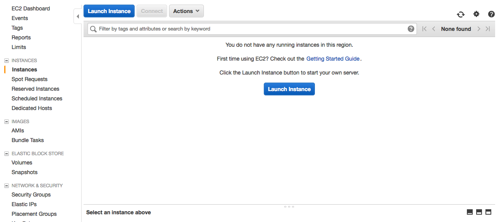

Select the AMI of your choice. In this demo we will use Ubuntu.

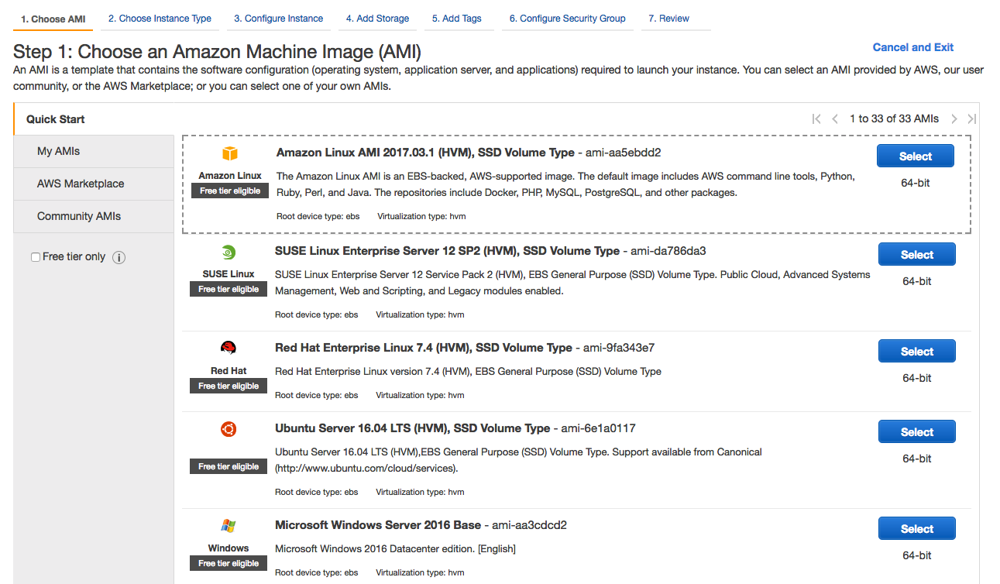

Select the Instance Type and click "Next: Configure Instance Details"

- TODO: validate if t2.micro runs fine

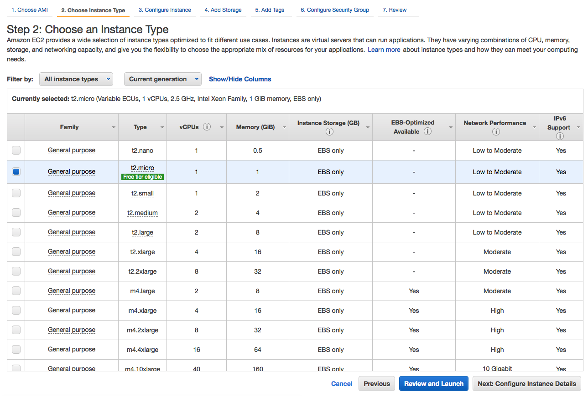

Take all the default values, but make sure that "Auto-assign Public IP" is set
to Enable. Click "Next: Add Storage"

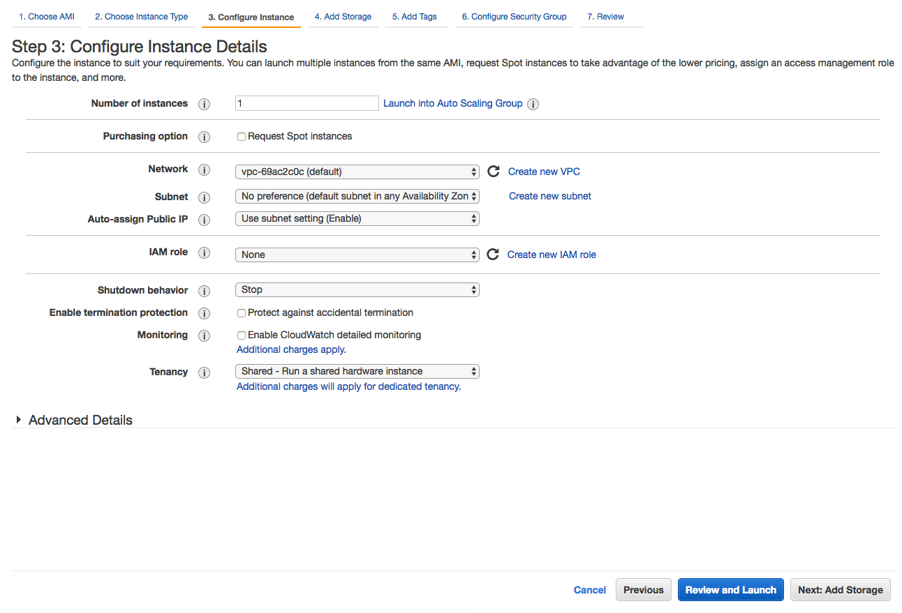

Take all the default values. Click "Next: Add Tags"

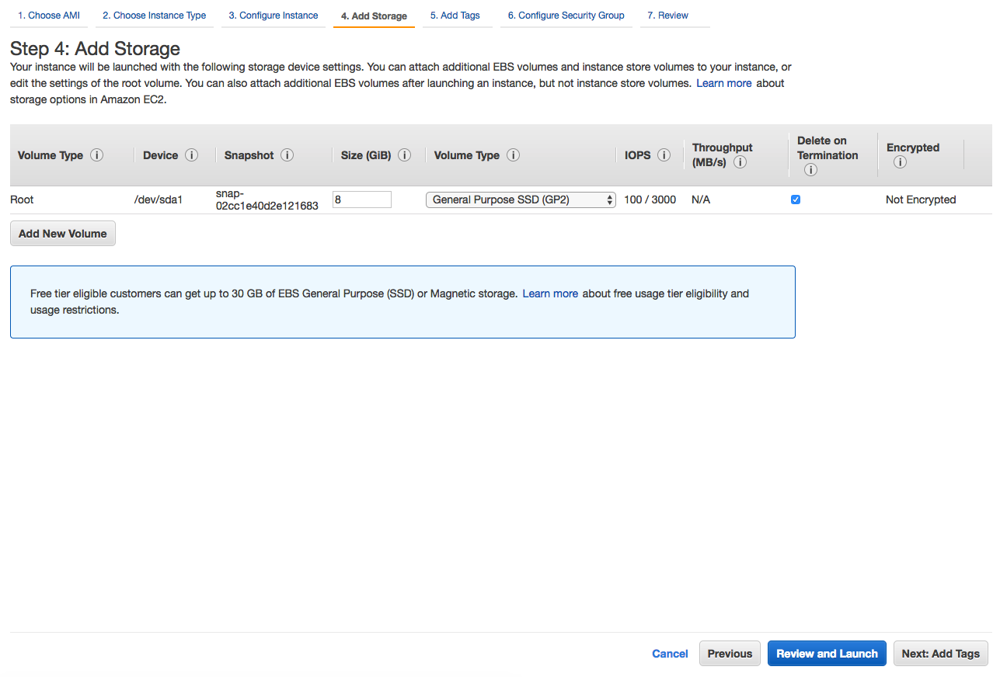

Always tag your AWS resources. Click "Next: Configure Security Group"

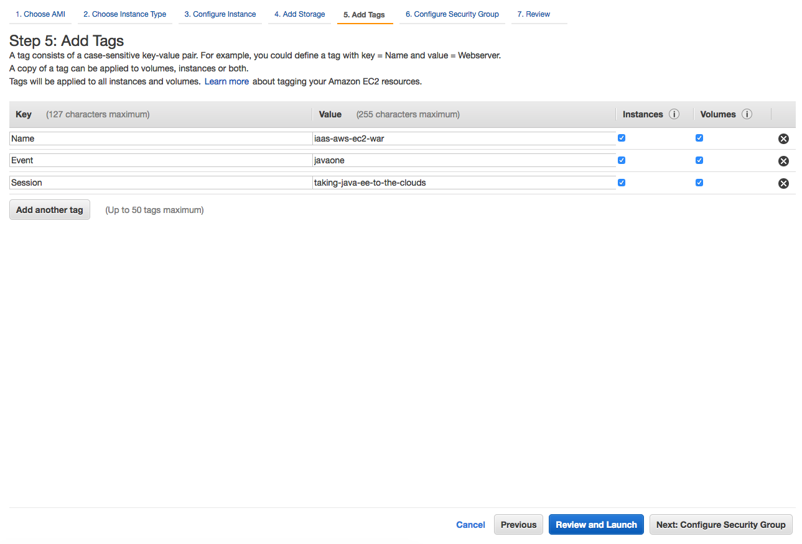

Create a new Security Group. Security Group acts as a virtual firewall that
controls the traffic for one or more EC2 instances. In this case we need to:
* Allow SSH incoming traffic
* Allow web traffic on port 8080 for the Cargo Tracker application
* Allow web traffic on port 4848 for GlassFish Admin Console

*Note: As displayed in the Warning box, opening ports to the whole world (0.0.0.0)
is not a recommended approach and it is only used for the purposes of this demo*

Click "Review and Launch"

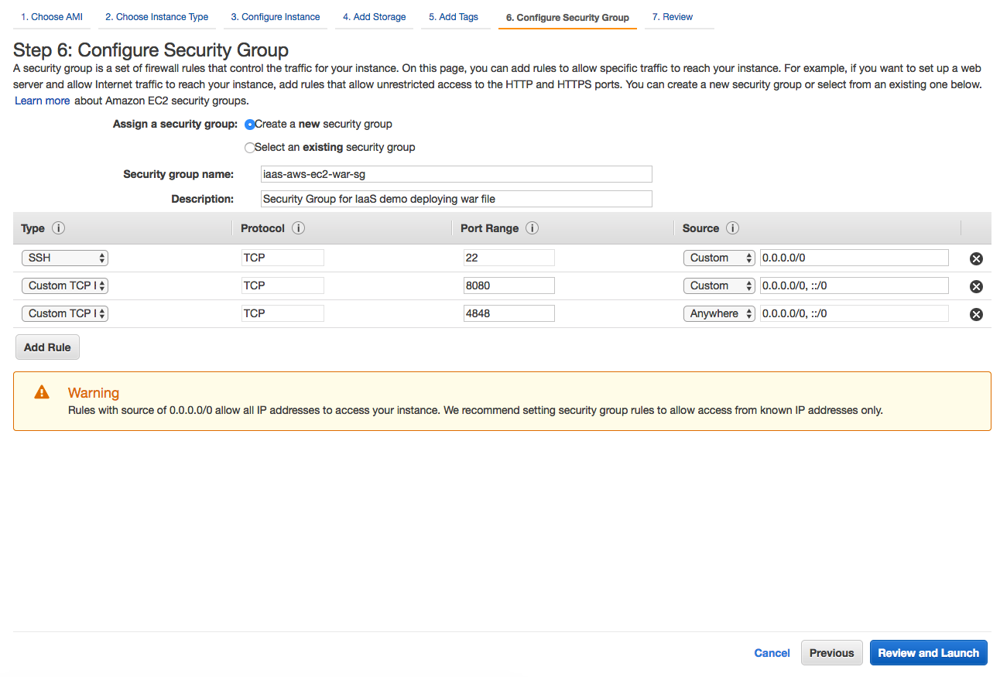

Review your configuration. Click "Launch"

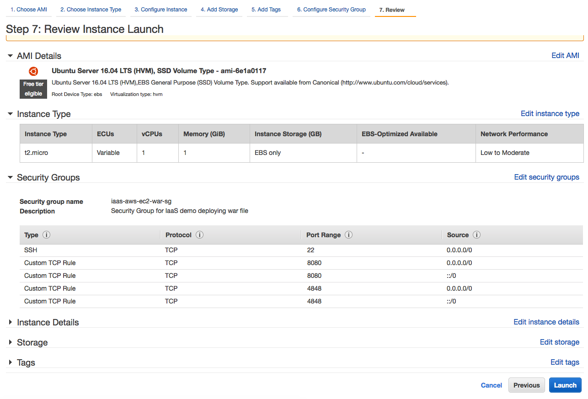

Select a key pair that will later be used to SSH to the Linux server. Click
"Launch Instances"

*For more information on key pair check the [AWS Key Pairs](#ec2-key-pairs)
link on the References section of this document called *

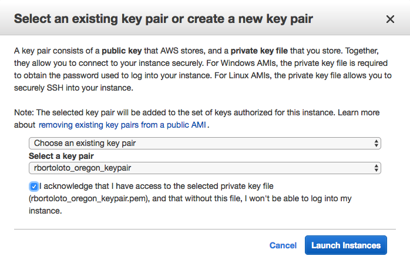

Your instance will be provisioned, usually in a few minutes. Click "View Instances"

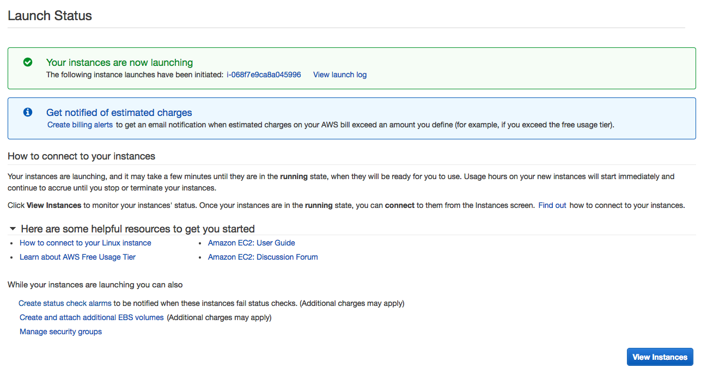

Wait until the EC2 instance finishes the provisioning process, moving the Status
Check from "initializing" ...

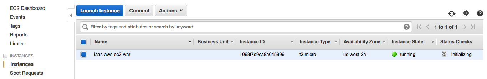

To "2/2 checks passed". With this, we are ready to setup GlassFish!

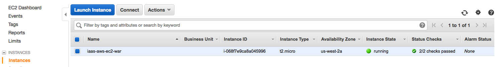

## GlassFish setup

Find the EC2 instance Public IP address:

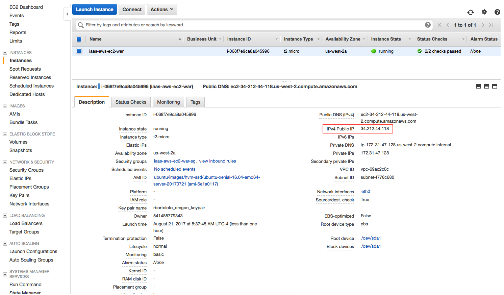

Open your favorite command line and SSH to the EC2 instance:

```shell
ssh -v -i rbortoloto_oregon_keypair.pem ubuntu@34.212.44.118```

### Install Java

```shell
sudo apt-get update
sudo apt-get install default-jre

# Check version
java -version
openjdk version "1.8.0_131"
OpenJDK Runtime Environment (build 1.8.0_131-8u131-b11-2ubuntu1.16.04.3-b11)
OpenJDK 64-Bit Server VM (build 25.131-b11, mixed mode)

# Find java home
sudo update-alternatives --config java
There is only one alternative in link group java (providing /usr/bin/java): /usr/lib/jvm/java-8-openjdk-amd64/jre/bin/java
Nothing to configure.```

Setup JAVA_HOME

```shell
# Update environment
sudo vi /etc/environment
source /etc/environment

# Validate
echo $JAVA_HOME
/usr/lib/jvm/java-8-openjdk-amd64
```

### GlassFish

Download GlassFish:

```shell
wget http://download.java.net/glassfish/4.1.2/release/glassfish-4.1.2.zip```

Unzip the downloaded file and "cd glassfish4" folder.

Start the default domain:

```shell
bin/asadmin start-domain
Waiting for domain1 to start ......
Successfully started the domain : domain1
domain  Location: /home/ubuntu/glassfish4/glassfish/domains/domain1
Log File: /home/ubuntu/glassfish4/glassfish/domains/domain1/logs/server.log
Admin Port: 4848
Command start-domain executed successfully.```

Enable Secure Admin to access the DAS remotely. The default GlassFish admin user is admin and password is empty/none.

```shell
bin/asadmin change-admin-password
Enter admin user name [default: admin]>
Enter the admin password>
Enter the new admin password>
Enter the new admin password again>
Command change-admin-password executed successfully.```

Enable secure admin and restart the domain:

```shell
bin/asadmin enable-secure-admin
Enter admin user name>  admin
Enter admin password for user "admin">
You must restart all running servers for the change in secure admin to take effect.
Command enable-secure-admin executed successfully.

bin/asadmin restart-domain```

## Deploying the Cargo Tracker application

TODO.

## References:

* [AWS EC2: Launch Your Instance](http://docs.aws.amazon.com/AWSEC2/latest/UserGuide/LaunchingAndUsingInstances.html)
* <a name="ec2-key-pairs">[Amazon EC2 Key Pairs](http://docs.aws.amazon.com/AWSEC2/latest/UserGuide/ec2-key-pairs.html)</a>
* [Connecting to Your Linux Instance Using SSH](http://docs.aws.amazon.com/AWSEC2/latest/UserGuide/AccessingInstancesLinux.html)
