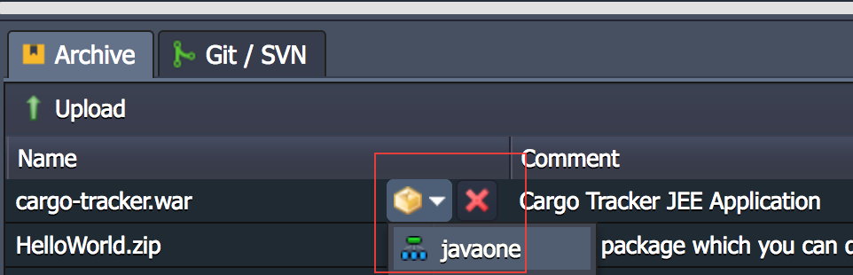

# Java EE on PaaS: Jelastic Java

Java EE is a first class citizen in the Jelastic PaaS environment. The
first service released late 2011 was for the Java EE platform.

This demo is using Jelastic Stark v.5.2 to deploy the Java EE Cargo Tracker
application on GlassFish 4.1.2.

The platform currently supports multiple Application Servers, Web Servers and Servlet Containers such as [GlassFish](https://javaee.github.io/glassfish/),
[JBoss](https://developers.redhat.com/products/eap/overview/), [Jetty](http://www.eclipse.org/jetty/), [Tomcat](http://tomcat.apache.org/), [TomEE](http://tomee.apache.org/apache-tomee.html) and [Wildfly](http://wildfly.org/). For the full list check the [Jelastic documentation](https://docs.jelastic.com/setting-up-environment#app-serv).

Create a free trial Jelastic account. No credit card required.

## Provisioning GlassFish Server

After login, click on **NEW ENVIRONMENT**. That will open a window with JAVA and
Tomcat as the selected options by default. Click on the *Tomcat logo* to expand the server options and Select **GlassFish 4.1.2** as shown below:

For this example, a single node of GlassFish will suffice. Define the vertical scaling configuration per node by selecting how much RAM and CPU will be *reserved* to each node. That is the computing capacity allocated and available at all times to the infrastructure (container) where the GlassFish server will be running. Still, as part of the vertical scaling configuration, define the *scaling limit* capacity that the server can grow to if the need arrives. For example, during peak times an application might require more memory to handle the load.

This configuration is based on Jelastic [Cloudlets](https://docs.jelastic.com/cloudlet). It is important to understand how it works and the billing model to avoid undesired billing surprises. The platform does a good job estimating the new environment initial cost as well as to how much it can grow based on scaling events.

On the right-hand side, enter the Environment Name or leave the default. Click **Create**.

After a few minutes the new environment Status will be *Running* and the GlassFish server will be ready to use.

**INFO:** Look for an email with the GlassFish Admin console user and password.

Click on the **Open in browser** button to test:

Validate the GlassFish Server is running:

It is necessary to have a [Public IP](https://docs.jelastic.com/public-ipv4) or [Endpoint](https://docs.jelastic.com/endpoints) configured to access the GlassFish Admin Console. This example uses an Endpoint. Select the environment and click **Tools**, it will open Setting window. Select **Endpoints** and click **Add**:

Select the node, give a name to the endpoint and select the private port it will map to, which in this case is GlassFish Admin 4848. Click **Add**:

Open the Endpoint *Access URL* in the browser and login to GlassFish (remember, the user and password are send via email during environment provisioning):

## Deploying the Cargo Tracker application

Jelastic has several options for deploying java applications, including building from source code and deploying directly. For simplicity, upload the Cargo Tracker war file using the Deployment Manager, available at the bottom of the page:

Click on Upload, select the file or url and upload it. The file will show in the Deployment Manager window.

Select the file to be deployed and click on the **Deploy to...*** button that will show eligible targets for deployment:

Enter the application context:

Once the deployment completes, open the browser using the same URL presented before to validate the GlassFish Server was running, add the application context and access the Cargo Tracker application:

## References:

* [What is Jelastic PaaS & CaaS?](https://docs.jelastic.com/what-is-paas-and-caas)
* [How to Create your Jelastic Environment](https://docs.jelastic.com/setting-up-environment)
* [Endpoints: A Direct Connection to the Cloud](http://ops-docs.jelastic.com/endpoints)
* [How to Deploy Projects to Jelastic Cloud](https://docs.jelastic.com/deployment-guide)
* [What is a Cloudlet?](https://docs.jelastic.com/cloudlet)
* [Jelastic Usage-Based Pricing](https://docs.jelastic.com/pricing-model)
* [Marketplace](https://jelastic.com/marketplace/apps/)
* [How to Configure GlassFish Cluster with Automatic Load Balancing](https://blog.jelastic.com/2016/08/16/how-to-configure-glassfish-cluster-with-automatic-load-balancing/)
* [Jelastic Cloud API](https://docs.jelastic.com/api-overview)
* [Docker® Standard Support Overview](https://docs.jelastic.com/dockers-overview)
