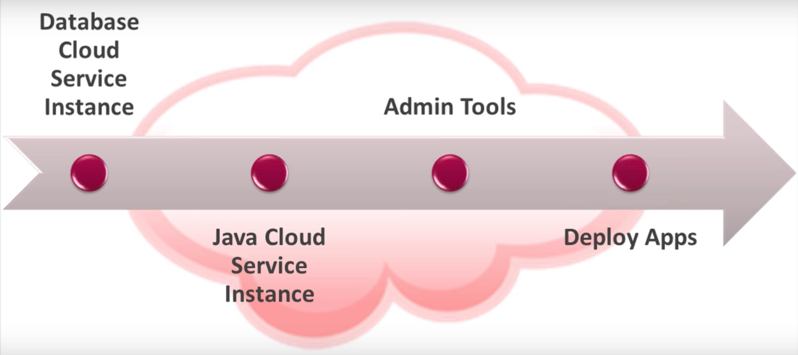

# Java EE on PaaS: Oracle Cloud Java

Oracle Java Cloud Service is a part of the platform service offerings in Oracle Cloud. Powered by Oracle WebLogic Server, it provides a platform on top of Oracle's enterprise-grade cloud infrastructure for developing and deploying new or existing Java EE applications.

When getting started you will find a nice article: [Creating an Oracle Java Cloud Service Instance by Using a QuickStart Template](https://docs.oracle.com/en/cloud/paas/java-cloud/jscug/creating-oracle-java-cloud-service-instance-using-quickstart-template.html#GUID-CE7CA098-F8D4-4BE2-AC7B-3D2D3AECD68D) but that requires a specific subscription type: *You must have a Universal Credits subscription in order to use QuickStart. This feature is not available to other subscription types.*

For that reason, proceed with the [Creating a Custom Oracle Java Cloud Service Instance](https://docs.oracle.com/en/cloud/paas/java-cloud/jscug/creating-custom-oracle-java-cloud-service-instance.html#GUID-AC867848-8FD9-458C-880B-F299FBC580E4) and all prerequisites. The final setup would have:

Unfortunately, the provisioning process is not intuitive and brings some complexities from on-premises setup that could and should be eliminated on the Cloud platform.

### WebLogic setup

Re-evaluate at a later time.

## References

* [Oracle Java Cloud Service](http://docs.oracle.com/en/cloud/paas/java-cloud/index.html)
* [Before You Begin with Oracle Java Cloud Service](http://docs.oracle.com/en/cloud/paas/java-cloud/jscug/you-begin-oracle-java-cloud-service.html#GUID-D0ACADB5-2415-450C-AE6A-0600752BDBA0)
* [Getting Started with Oracle Java Cloud Service](https://www.youtube.com/watch?time_continue=139&v=7vBCbcyJS2M)
* [Running Cargo Tracker with WebLogic](http://git.delabassee.com/ct/WlsHowTo.html)
